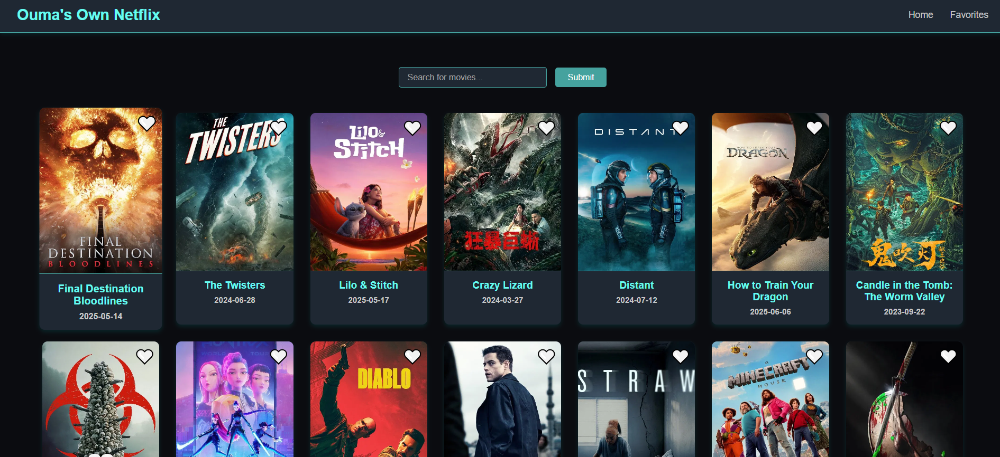

# 🎬 Ouma's Own Netflix

A modern, Netflix-inspired movie web application built with **React**, **Vite**, and **The Movie Database (TMDB) API**. It features a stylish blue-themed UI, dynamic movie browsing, and the ability to mark favorites.

---

## 🔥 Preview

Here’s what the app looks like:



---

## 📌 Features

- 🎥 Browse real movies using the TMDB API
- 🔍 Search for movies by title
- 🤍 Mark favorites with a heart icon
- 📱 Responsive layout for mobile and desktop
- 🚀 Fast development experience with Vite
- 🧩 Modular React component structure

---

## 🛠️ Tech Stack

- **React**
- **Vite**
- **TMDB API**
- **CSS3**
- **React Router**

---

## 🚀 Getting Started

### 1. Clone the repository

```bash
git clone https://github.com/OUM124/NetflixLikeApp.git
cd NetflixLikeApp
```

### 2. Install dependencies

```bash
npm install
```


### 4. Run the app locally

```bash
npm run dev
```

The app will open at `http://localhost:5173`.

---

## 🗂️ Folder Structure

```
.
├── public/
│   └── screenshot.png
├── src/
│   ├── Components/
│   ├── Pages/
│   ├── Css/
│   ├── App.jsx
│   └── main.jsx
├── .env
└── README.md
```

---

## 📬 Contact

Made with 💙 by **Ouma**  


